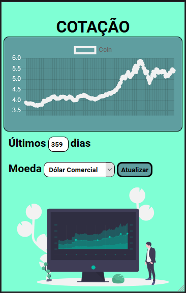
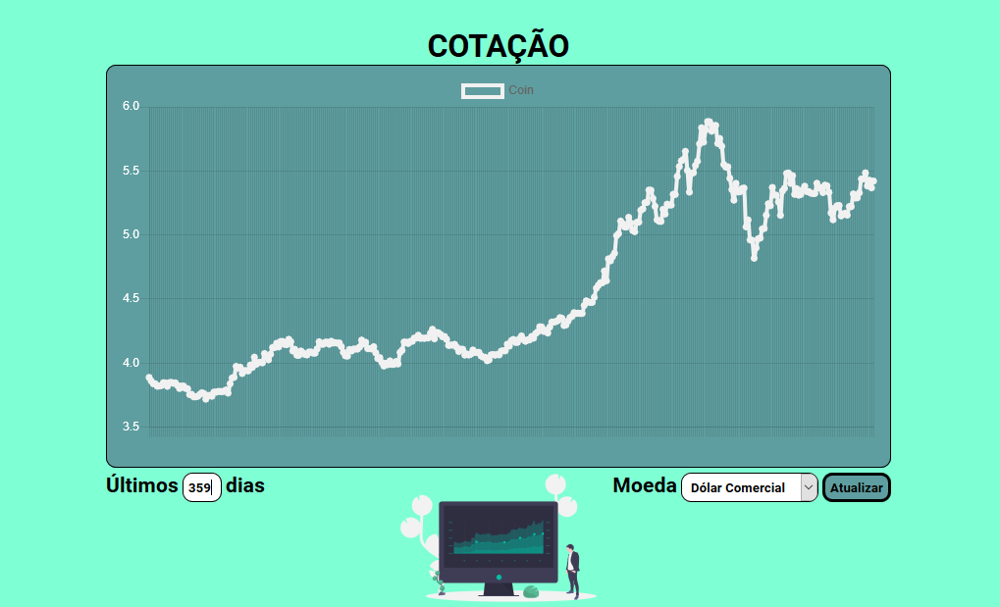

<h1 align="center">QuotationGraph</h1>
 
<h2 align="center">Descubra qual é a quotação dos ultimos dias seja Dolar, Euro ou até BitCoin</h2>

 

<strong><a href="https://github.com/CaioHenriqueMachado/QuotationGraph-project/index.html">ACESSAR SITE</a></strong>

 

<h1 align="center">Mobile Version</h1>

  

 

<h1 align="center">Web responsive Version </h1>

  

 

 
  <h2 align="center">FEATURES :book:</h2>
 

- 🔀 **AwesomeAPI**     - API usado para a busca dos dados da moeda.
- 📈 **Chart.JS**       - Para inserir gráfico.
- 🟠 **HTML5** 		      - Para construir a estrutura do site.
- 🟣 **CSS3** 	        - Para a estilização e personalização das estruturas no site.
- 🟡 **JavaScript**     - Para inserir dados da API no gráfico.

 